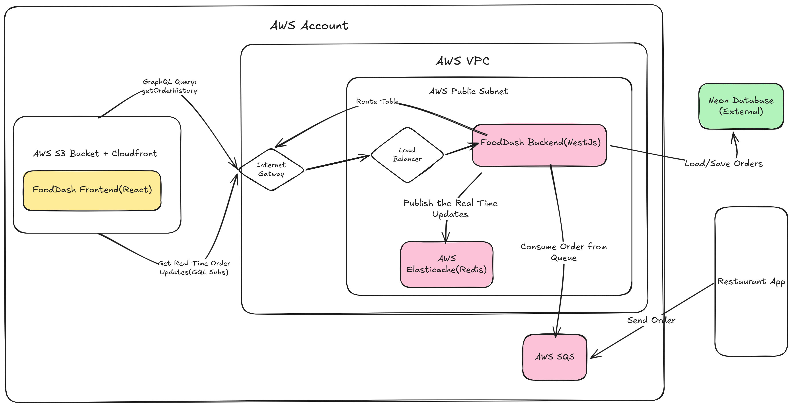

# Food Dash

Food Dash is a real-time food delivery tracking platform built as an event-driven microservice architecture. The system combines a React frontend with a NestJS backend and is designed for full deployment on AWS.

Watch the Project Explanation Here: youtu.be/xzBQLHGxbuk

## Architecture Diagram



## Architecture Overview

Food Dash is organized around loosely coupled services that communicate through asynchronous messaging and real-time updates:

- React frontend in `frontend/` provides the live order dashboard.
- NestJS backend in `src/` exposes the GraphQL API and coordinates order workflows.
- AWS SQS acts as the event ingestion layer for order status updates.
- Redis powers pub/sub fan-out for real-time GraphQL subscriptions.
- PostgreSQL with Prisma persists orders, addresses, and order items.
- Terraform is used to provision AWS infrastructure for cloud deployment.

The delivery flow is:

1. An external producer publishes order events into AWS SQS.
2. The NestJS worker consumes and processes the messages.
3. The backend updates PostgreSQL through Prisma.
4. Redis broadcasts status changes.
5. The React dashboard receives updates through GraphQL subscriptions and refreshes in real time.

## Tech Stack

### Frontend

- React 19
- Vite
- Apollo Client
- GraphQL subscriptions over WebSockets

### Backend

- NestJS
- GraphQL with Apollo
- Prisma ORM
- PostgreSQL
- Redis
- AWS SDK for SQS

### Infrastructure

- AWS for production deployment
- Terraform for infrastructure as code
- Docker Compose and LocalStack for local development

## Repository Structure

```text
food-dash/
├── frontend/         # React application and Apollo client
├── src/              # NestJS API, resolvers, services, and workers
├── prisma/           # Prisma schema and migrations
├── redis/            # Redis integration module
├── scripts/          # Utility scripts for SQS setup and test messages
├── infra/            # LocalStack state and local AWS emulation assets
└── terraform/        # Terraform deployment assets
```

## Local Development

### Prerequisites

- Node.js
- npm
- Docker and Docker Compose

### Install dependencies

```bash
npm install
cd frontend && npm install
```

### Start local infrastructure

```bash
docker compose up -d
```

This starts:

- PostgreSQL
- Redis
- LocalStack with SQS support

### Run the backend

```bash
npm run start:dev
```

### Run the frontend

```bash
cd frontend
npm run dev
```

## Useful Commands

### Backend

```bash
npm run build
npm run start:dev
npm run test
npm run test:e2e
npm run lint
```

### Frontend

```bash
cd frontend
npm run dev
npm run build
npm run lint
```

### SQS Helper Scripts

```bash
npm run script:create-queue
npm run script:send-order
```

## AWS Deployment

The application is structured to run fully on AWS as a cloud-native, event-driven system:

- the frontend can be deployed as a static React application,
- the NestJS backend can be deployed as the API and worker service,
- AWS SQS handles asynchronous order event delivery,
- managed data services back the real-time and persistence layers,
- Terraform manages the infrastructure definition.

For local development, the repository uses Docker Compose and LocalStack to mirror the production architecture as closely as possible.

## License

This project is licensed under the terms in [LICENSE](./LICENSE).
